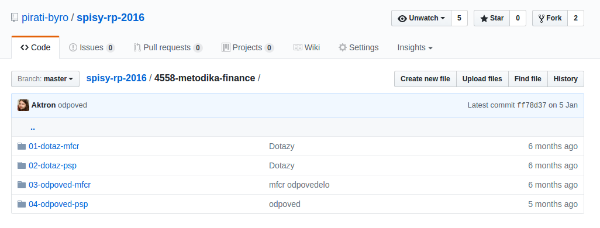
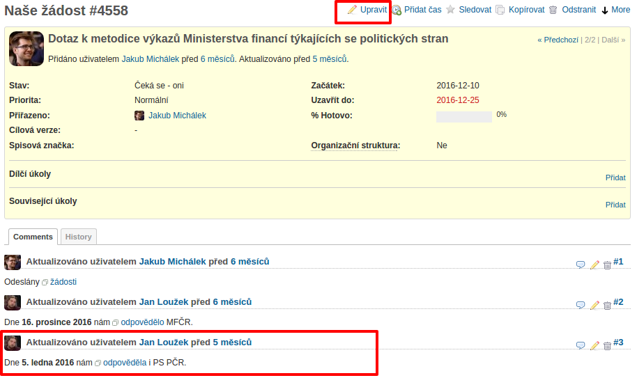

# Zakládání dokumentů do spisové služby

## Úvod

* Tento dokument podrobně definuje proces zakládání dokumentů do spisů ve
  spisové službě.

* Založení dokumentu do spisové služby předchází jednak tvorba dokumentů a
  jednak [založení spisu][postup-spisy].

* Tento proces je podprocesem [vedení spisové služby][postup-spisovka]. Pokud není uvedeno či z
  kontextu nevyplývá něco jiného, platí pro tento podproces totéž, co pro
  nadřízený proces.

## Definice procesu

Účelem zakládání dokumentů do spisové služby v listinné i elektronické
podobě je, abychom

* zamezili ztrátě jeho originálu,
* zajistili autenticitu elektronické podoby,
* zrychlili sdílení dokumentu mezi lidmi v organizaci a
* usnadnili orientaci ve věci spisu a tedy zastupitelnost a audit a
* usnadnili pozdější vyhledání dokumentu.

## Cíle procesu

**Cílem** tohoto procesu je, aby byl

* každý dokument řádně založen do spisové služby,
* byla o něm dostatečně a prokazatelně informována osoba, která ho má vyřídit,
* byly nastaveny termíny pro jeho vyřízení, které lze hlídat.

## Typické vstupy procesu

### Potřebné informace

* příchozí dokument do datové schránky, poštovní schránky, případně
  v odůvodněných případech e-mailové pošty, nebo
* odchozí dokument ve formátu PDF.

## Typický postup

Přijde mi dokument k založení do spisové služby. Konkrétně ho budeme zakládat
do spisu, který koresponduje s jedním úkolem v úkolovníku a jednou složkou ve
spisovém repozitáři, viz podrobně [postup pro založení spisu][postup-spisy].

### 1. Posouzení režimu dokumentu

Podle tohoto postupu se nepostupuje a je třeba použít zvláštní postup,
pokud se v dané věci nezakládá spis, viz [postup pro zakládání spisů][postup-spisy].

### 2. Hledání spisu

Související spis se pokusíme dohledat vždy

* v projektu toho týmu, kterého se spis týká, viz
  [seznam projektů](https://redmine.pirati.cz/projects) na úkolovníku,

* v repozitáři toho týmu, kterého se spis týká, viz
  [seznam spisových repozitářů][spisy] v úložišti.

Příklady tipů k dohledání spisu podle druhu dokumentu:

* Pokud jde o náš první **odchozí dokument**, vždy by v něm měla být uvedena naše spisová značka
(např. RP #2343), tedy spis je potřeba zakládat před tím, než vygeneruji
odchozí dokument do PDF, viz [postup pro založení spisu][postup-spisy].
Stačí v podstatě založit před vygenerováním dokumentu úkol v redmine.
To by měl vědět každý, kdo takové dokumenty generuje, protože jinak nebude
v reakcích našich partnerů spisová značka a spisy se nám budou hůře zakládat.

* Pokud jde o **příchozí dokument**, zjistím nejprve, zda již v dané věci
existuje spis. Spis existuje, pokud jsme již v dané věci někomu něco
posílali nebo oni již něco posílali nám. Poznám to například tak, že
v příchozím dokumentu reagují na nějaký náš odeslaný dokument a uvádějí
naši spisovou značku (např. RP #2343), nebo si zkusím vyhledat věc
v úkolovníku nebo na úložišti podle klíčových slov. Pokud spis neexistuje (tj. jde o první
příchozí dokument v dané věci, např. nějaké upozornění ze strany úřadů),
založím spis podle [postupu pro založení spisu][postup-spisy].

### 3. Digitalizace papírového dokumentu

* Pokud je příchozí dokument papírový, referent (pokud možno) na jeho
horní část zaznamená, kdy byl doručen a číslo spisu, kterého se týká
(pro tento účel lze poučít i razítko).

* Takto označený dokument referent naskenuje nebo vyfotí a převede do
formátu PDF; body 7.2 a následující se týkají pouze elektronické
podoby dokumentu.

* Papírovou podobu založí do papírového spisu, který je uložen v papírové
spisové službě daného týmu, typicky v jeho skříni, viz
[postupu pro založení spisu][postup-spisy].

### 4. Nahrání dokumentu do úložiště

Nyní tedy již mám číslo spisu, kterého se dokument týká. Zakládaný dokument
nahraju pomocí gitu do úložiště na githubu.

* Název složky je tvořen číslem úkolu, spojovníkem a zkráceným názvem bez diakritiky (např. ``1234-odmeny-krobove-hasove``).

* V každé složce jsou obdobné podsložky pro jednotlivé dokumenty
  (např. ``02-odvolani``). Ve složkách jsou i přílohy.

* Dokument je třeba nahrát do podsložky daného spisu, která je nazvána podle

  * čísla úkolu a věci ve spisu, např. ``4558-metodika-finance/`` a dále
  * podle pořadového čísla dokumentu v daném spisu, např. ``04-odpoved-psp`` (viz obrázek).

* Pořadové číslo dokumentu
se uvádí s uvozovacími nulami vždy na 2 cifry, aby se dokumenty správně řadily.

* Pokud má referent pochybnost, zda je v zájmu strany nebo v souladu se
zákonem určitou věc zveřejnit, zeptá se vedoucího týmu nebo jeho zástupce,
případně použije soukromou poznámku či vloží spis do soukromého úložiště.

### 5. Určení termínu pro reakci

* Pro určení termínu pro uzavření je podstatné
datum, kdy nám byl dokument doručen nebo byl odeslán (podle údajů v datové
schránce nebo vyzvednutí na poště).

* Datum doručení nebo
odeslání a výpočet lhůty je potřeba průkazně zaznamenat. Datum doručení
je určeno [pravidly pro doručování](http://www.mvcr.cz/clanek/obcane-tretich-zemi-prubeh-rizeni-prijimani-a-dorucovani-pisemnosti.aspx). Na správné určení data doručení je potřeba
si dát velký pozor, protože právě od něho se lhůty odvíjejí.

Lhůta je určena věcí, o kterou jde, a typicky vyplývá ze zákona
nebo ze standardního obchodního styku. Vypočtěte tedy den lhůty,
do kdy je třeba spisu věnovat pozornost:

* V případě **příchozího dokumentu** je termínem pro reakci například den,
do kdy je třeba podat odvolání v 15denní lhůtě podle poučení v příchozím dokumentu,

* v případě **odchozího dokumentu** je termínem pro reakci den, kdy uplyne
úřadu zákonná nebo jiná přiměřená lhůta (plus případně několik dní k dobru),
a kdy tedy bude případně nutné urgovat vyřízení naší žádosti, pokud
nedostaneme žádnou odpověď (např. podat stížnost kvůli nečinnosti).

### 6. Vložení poznámky do úkolovníku

* Nyní je potřeba vložit poznámku o založeném dokumentu do příslušného úkolu
  na [redmine](https://redmine.pirati.cz).

* Najděte si příslušný úkol na redmine podle čísla (zde je to
  úkol 4558) a klikněte na tlačítko ``Upravit`` v horní liště.

* Přidejte také hypertextový odkaz na
  konkrétní dokument v úložišti (pokud možno rovnou na náhled příslušného
  pdf dokumentu). Tento hypertextový odkaz najdete přímo po rozkliknutí
  struktury souborů ve spisovém repozitáři.

* Napište do textového pole
  poznámku, kdy byl dokument doručen nebo odeslán, co a kdy je
  potřeba udělat, tj. termín pro reakci (viz obrázek níže). Pokud byl originál
  dokument také fyzicky založen do papírového spisu, uveďte to v poznámce také.

* Lhůta se zároveň nastaví do pole ``Uzavřít do`` u daného úkolu.

 

### 7. Zaúkolování zodpovědného člověka

Pokud věc vyřizuje někdo jiný než referent, informuje referent tohoto člověka
o tom, že byl založen dokument a jak a do kdy je třeba reagovat či rozhodnout
o dalším postupu. Referent zejména dostatečnou dobu před termínem pro reakce
tohoto člověka a udělá všechny následující věci:

* kontaktuje osobně či telefonicky s vysvětlením úkolu a termínem,
* dále mu zašle e-mail, kde bude v příloze nebo pod odkazem založený dokument, a
* přiřadí zodpovědného člověka do pole ``Přiřazeno`` u daného úkolu v úkolovníku.

Doporučený postup je vyřizovat došlé věci obratem, kdykoliv je to v našem
zájmu, nikoliv až na konci lhůty.

[prehled-ss]: https://redmine.pirati.cz/issues?utf8=%E2%9C%93&set_filter=1&f%5B%5D=status_id&op%5Bstatus_id%5D=o&f%5B%5D=subject&op%5Bsubject%5D=~&v%5Bsubject%5D%5B%5D=spisov%C3%A1+slu%C5%BEba&f%5B%5D=&c%5B%5D=project&c%5B%5D=subject&c%5B%5D=assigned_to&group_by=&t%5B%5D=

## Typický výstup procesu

* Založený (odeslaný či přijatý) dokument v systému,
* založený úkol v úkolovníku a nastavený termín pro reakci v dané věci,
* prokazatelně informovaná osoba, která má dokument vyřídit.

## Rizika

### Nezaložení dokumentu

* Riziko je středně pravděpodobné a může být vážné, protože dokument nebude dohledatelný v okamžiku, kdy ho potřeba.
* Ke zmírnění rizika slouží jednotný a centrální systém zakládání dokumentů v rámci daného týmu, dobrý výcvik referentů spisové služby a informovanost všech lidí o povinnosti zakládat podstatné dokumenty do spisové služby (např. zastupitelů, hospodářů apod.).

### Chybná data

* Riziko chybného založení termínu či chybný výpočet lhůty je středně pravděpodobné a může být vážné, pokud prošvihneme lhůtu pro důležité odvolání nebo stížnost.
* Ke zmírnění rizika je potřeba, aby se referent spisové služby dobře soustředil během výpočtu lhůty, aby byl náležitě poučen o pravidlech stanovení okamžiku doručení, určení lhůt z platných předpisů a výpočtu hmotněprávních a procesněprávních lhůt. Proto je třeba složitější výpočty lhůty zdokumentovat.

## Související

* [Vedení spisové služby][postup-spisovka]
* [Zakládání dokumentů][postup-dokumenty]
* [Zakládání spisu][postup-spisy]
* Zadávání úkolů
* Kontrola pošty

[postup-spisovka]:  README.md
[postup-spisy]: zakladani-spisu.md
[postup-dokumenty]:  zakladani-dokumentu.md
